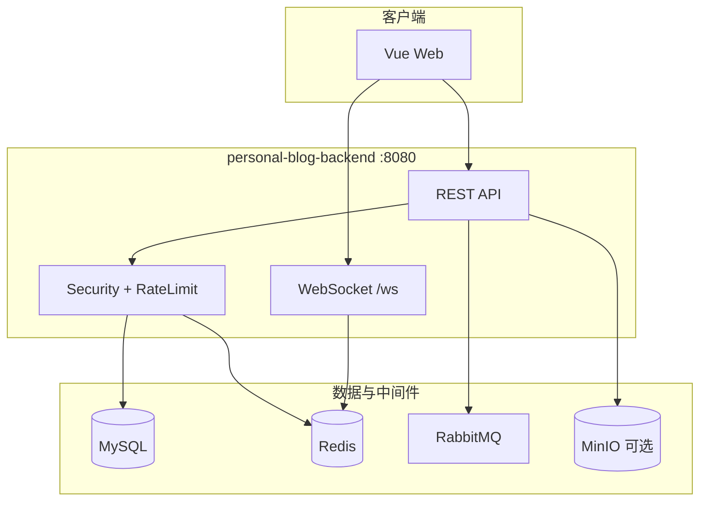

# 架构总览

## 系统边界

## 同步路径

典型读请求（文章详情）：

1. `ApiRateLimitFilter` / `TraceIdFilter`
2. `ArticleService` → `ArticleCacheService`（Caffeine L1 → Redis L2 → DB）
3. 热点详情可选 `ArticleDetailRequestCoalescer` 合并并发查询

写请求在事务提交后，通过 MQ 异步失效缓存或投递通知。

## 异步路径

| 场景 | 交换机/队列 | 说明 |
|------|-------------|------|
| 点赞/收藏/关注通知 | `blog.notification` | 事务后 `NotificationProducer.sendAfterCommit` |
| 互动持久化 | `blog.interaction` | 计数落库，消费幂等 |
| 内容变更清缓存 | `blog.content` | `ContentCacheConsumer` |

## 聊天

- HTTP 发送 + WebSocket 广播
- Redis：在线状态、消息去重、离线队列、Stream fanout
- 冷数据归档 MinIO（定时任务）

## 可观测

- 业务指标端口 **8081**：`/actuator/prometheus`
- 日志 MDC 字段 `traceId`，MQ 头 `X-Trace-Id`

详见 [observability.md](observability.md)。
