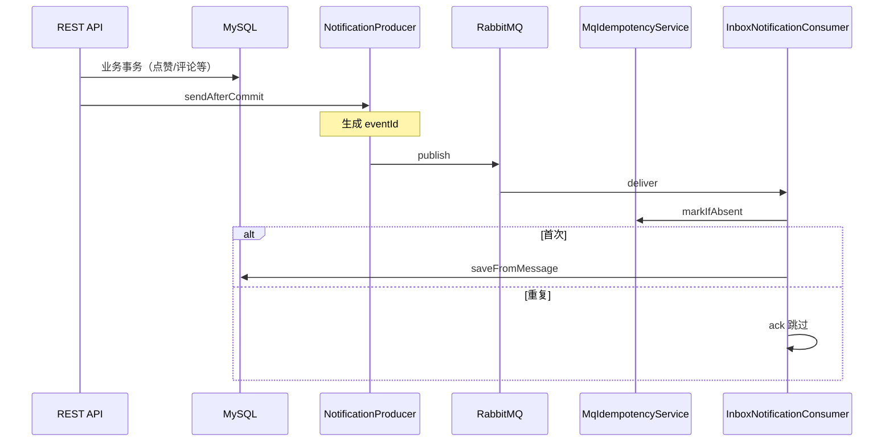

# 通知链路

## 流程概览



## 关键代码

- 生产：`NotificationProducer.sendAfterCommit` — 事务提交后发 MQ；无 `eventId` 时自动生成 UUID
- 消费幂等：`NotificationConsumeHelper` + `MqIdempotencyService`（Redis key `mq:consumed:{queue}:{eventId}`，TTL 见 `blog.notification.idempotency-ttl-days`）
- Inbox 落库：`user_notification.event_id` + 唯一索引 `uk_notif_recipient_event`，`DuplicateKeyException` 兜底
- DLQ：消费失败 `basicNack` → `{queue}.dlq`

## 路由键示例

| 事件 | routingKey |
|------|------------|
| 点赞 | notification.like |
| 收藏 | notification.favorite |
| 评论 | notification.comment |
| 关注 | notification.follow |
| 文章发布 | notification.article.published |

## 运维

- `GET /api/admin/notification-mq/status` — 连接、各队列 `messageCount` / `consumerCount` / `dlqMessageCount`
- DLQ 重放：在 RabbitMQ 管理台将 `.dlq` 消息 requeue 或手工转发（暂无自动重放 API）
- 日志：`eventId` + `traceId`（AMQP 头 `X-Trace-Id`）

## 已有库迁移

```sql
ALTER TABLE `user_notification` ADD COLUMN `event_id` varchar(64) NULL AFTER `content`;
ALTER TABLE `user_notification` ADD UNIQUE INDEX `uk_notif_recipient_event`(`recipient_user_id`, `event_id`);
```
