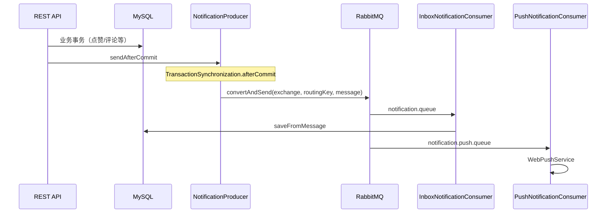

# 通知链路

## 流程概览

## 关键代码

- 生产：`NotificationProducer.sendAfterCommit` — 仅在事务提交后发 MQ，避免脏读回滚仍发消息
- 消费：`InboxNotificationConsumer` — 手动 ACK，失败 `basicNack` 进 DLQ（`blog.notification.dead-letter-enabled=true` 时）
- 拓扑：`RabbitMQConfig` — Topic 交换机 `blog.notification`，队列 inbox/push/mail/audit，DLX `blog.dlx`

## 路由键示例

| 事件 | routingKey |
|------|------------|
| 点赞 | like |
| 收藏 | favorite |
| 评论 | comment |
| 关注 | follow |
| 文章发布 | article.published（push/mail） |

## 运维

- 管理端：`GET /api/admin/notification-mq/status` — 连接与队列名
- DLQ 队列名：`{queueName}.dlq`
- 日志排查：同一 HTTP 请求的 `traceId` 会写入 AMQP 头 `X-Trace-Id`（见 [observability.md](observability.md)）

## 后续增强（未实现）

- Inbox 消费端 messageId 幂等（互动队列已有 `MqIdempotencyService`）
- 队列深度 Prometheus Gauge
